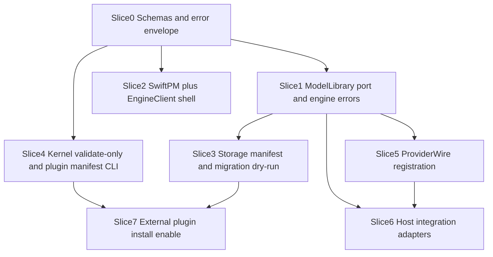

> Non-normative research input. Read [the canonical plan](../PLAN.md), [boundary scope](../BOUNDARIES.md), and [review corrections](../REVIEW.md) before implementing. Recommendations in this report may have been rejected or superseded.

# Delivery sequencing, build packaging, and verification gates (research 10)

**Author:** plan_delivery subagent (Composer 2.5; Fast mode unverified)  
**Date:** 2026-09-12  
**Scope:** Planning only. Read-only inspection of `build.sh`, `README.md`, `VERIFICATION.md`, and sibling research `01`–`07`. No builds, installs, or runtime mutation in this task.

## Recommendation

Ship the plugin architecture as **seven major implementation waves** with **one finalizer** per wave, **at most six concurrent code-writing agents**, and **no parallel implementation against unsettled contracts** (`schemas/`, `engine.v1` op table, `ModelLibrary` port signatures). Keep the **production-adjacent default** (`zsh build.sh` → sibling `../Model Deck.app`, pinned `signing-identity`, credential-helper hash gate at `build.sh` ~21–34) untouched until a slice explicitly owns packaging. Use **proposed staging outputs** for all automated and multi-agent verification so the user’s running `/Applications/Model Deck.app` and active Codex/router processes stay protected per BRIEF.

**Rejected:** Big-bang rewrite commits; rebuilding into `/Applications` from worker agents; sharing one dirty bundle between SwiftPM migration and Python router extraction; plugin payloads inside `build.sh` copy list before kernel validate exists (`03-plugins.md`).

## Grounded build and packaging today

| Step | `build.sh` behavior | Risk if changed mid-migration |
|------|---------------------|-------------------------------|
| Python gate | Requires Python ≥3.11 on PATH (~6–9) | Wrong interpreter baked into `Info.plist` `PythonExecutable` (~69) |
| Helper | Rebuild/sign helper only when Swift source SHA changes; else `codesign --verify --strict` (~27–34) | Keychain identity drift if helper bytes change without intent |
| Vendor | `pip install --target …/vendor` `tomlkit==0.13.3`; rm vendor each build (~37–38) | Test `PYTHONPATH` must track vendor (`README.md` ~124) |
| Swift UI | Temp dir `swiftc` of `UsageDashboard.swift` + copied `OpenRouterSettings.swift` as `main.swift` (~56–57) | SwiftPM cutover must preserve single executable + `OpenRouterSettings` symlink (~58–59) |
| Seal | Strip `__pycache__` under bundle (~72–73) | Strict `codesign` failure if bytecode appears after sign |
| Sign app | `MODEL_DECK_SIGNING_IDENTITY` or `signing-identity` file; refuse missing cert (~74–86) | Accessibility grant loss on ad-hoc sign |

Resources copied are a **flat manifest** of Python modules and `CodexProviderBridge` (~39–55). Any kernel plugin loader must **not** append dynamic copies here until a slice adds explicit install rules and signing review.

## Proposed alternate outputs (do not execute in planning)

1. **`MODEL_DECK_APP_OUTPUT`** (proposed env): absolute path to `.app` root; default remains `$(dirname repo)/Model Deck.app`. Worktrees build to `…/worktrees/<branch>/dist/Model Deck.app` without touching the user’s Applications install.
2. **`git worktree add`** (proposed): one worktree per long-running slice owner; shared `signing-identity` read-only; never two writers on same worktree.
3. **Staging install** (proposed): `dist/Model Deck-<short-sha>.app` + optional `Backups/` snapshot before manual promote to `/Applications` (pattern already used in `VERIFICATION.md` rollback notes).
4. **Artifact-only packages** (proposed): `python -m build` / wheel for future `engine_bridge` entrypoint—not in current `build.sh`; defer until `02-api.md` Phase 1 lands.

**Live proof vs packaged proof:** Source checkout ≠ built bundle (`MEMORY_SUMMARY`: compare source with `Model Deck.app` before routing claims). Delivery ladder must record **source commit**, **bundle codesign TeamIdentifier**, **helper SHA-256**, and **CFBundleShortVersionString** per gate (historical pattern in `VERIFICATION.md` spawn-metadata section).

## Dependency DAG and gates

Edges are **hard gates** (downstream must not start until upstream merges or lead publishes frozen contract).

**Contract freeze gate:** Before Wave 2 code, lead tags `contracts/v1` in plan (schema ids + `engine.v1` op list from `02-api.md`). Swift and Python agents consume the same tag; no field renames without bumping `schemaId`.

**Router-active gate (`07-migration.md`):** Migration apply steps refuse while ledger/router append is live unless operator `--offline`; planning default carries into CI scripts.

## Ownership waves (max six writers)

| Wave | Writers (≤6) | Owns | Blocked until |
|------|----------------|------|----------------|
| W1 | 3 | `schemas/*`, `engine_errors.py`, SwiftPM scaffold (`04-swift.md` M0) | — |
| W2 | 3 | `ModelLibrary` wrapper, `ProjectionExport` read-only, `ModelDeckEngineClient` + dispatcher sketch | W1 contract freeze |
| W3 | 3 | `ProviderWire` extraction (`05-providers.md`), `ImportScan`, presenter extractions (Connections/Models) | W2 library port |
| W4 | 2 | Kernel supervisor + manifest validator (`03-plugins.md`), `host.integration` Codex adapter split (`06-hosts.md`) | W1 schemas + W3 routing stable |
| W5 | 2 | Connections schema migration (`07` slice 6), plugin storage broker policy | W3 + W4 validate |
| W6 | 1 | External enable path + SDK stub publish (`02-api.md` slice 8) | W4 + W5 |

**One finalizer per wave** runs the verification ladder (below), updates `VERIFICATION.md` only when lead requests, and owns **aggregate** pytest + staging `codesign --verify --deep --strict`. Workers do not install to `/Applications`.

**Tightly coupled files** (single owner per wave): `local_router.py` + `provider_bridge.py` (W3); `OpenRouterSettings.swift` IPC cluster (W2–W3); `routing_registry.py` + `codex_settings.py` writes (W2–W5).

## Verification ladder (proposed; not run here)

| Level | Command / check | When required |
|-------|-----------------|---------------|
| L0 | `rg` schema references; manifest op ↔ schema | Every commit touching `schemas/` |
| L1 | `python3 -m unittest discover` with built or staged `Contents/Resources/vendor` on `PYTHONPATH` | Every Python behavior slice |
| L2 | `swiftc` or `swift build` + `--self-test-companion` / `--self-test-keychain` | Swift shell changes |
| L3 | `zsh build.sh` to **staging output only**; helper hash unchanged unless helper slice; no `__pycache__` | Pre-merge packaging |
| L4 | Headless bridge argv + MCP stdio smoke (patterns in `VERIFICATION.md`) | Router/bridge/MCP slices |
| L5 | Live Codex/OpenRouter/Cursor qualification | User-triggered; not worker default |

Historical baseline: **246** Python tests cited in `VERIFICATION.md` (2026-09-12); treat count as drift-prone until finalizer refreshes. **Worker Editing-check:** NONE per BRIEF.

## Signed helper and resource continuity

- **Helper continuity:** Any slice touching `OpenRouterCredentialHelper.swift` must be its own commit; finalizer records SHA-256 in delivery notes. Non-helper slices must hit the verify-only branch (~31–33).
- **Resource parity:** New engine modules must be added to `build.sh` copy list in the **same commit** as source file, or router launch fails at runtime.
- **Cursor SDK support dir** (`~/Library/Application Support/Model Deck/cursor-sdk`) remains **outside** the signed bundle; plugin slices must not relocate it without migration (`README.md` Cursor section).

## External plugin distribution lifecycle (v1)

Follow `03-plugins.md` lifecycle. Ship **validate-only CLI** before enable; install under `Application Support/Model Deck/plugins/<id>/<version>/` with atomic writes; distribute zip manifest + payload (**not** in `build.sh` until Slice 7). Builtins use the same manifest with `builtin: true` from proposed `Resources/extensions/` after validator exists. Third-party payloads are not app-codesigned; trust is capability manifest + host broker.

## Major implementation slices (7) with acceptance

1. **Contract package** — Add `schemas/engine/v1`, `schemas/plugin/v1`, shared error codes (`02-api.md` slices 1–2).  
   **Acceptance:** L0 only; zero runtime behavior change.

2. **Engine port façade** — `ModelLibrary` wraps registry load/write; unify subprocess JSON behind one dispatcher module (proposed `engine_bridge.py`).  
   **Acceptance:** L1 existing registry/MCP tests green; Swift may still call legacy scripts behind flag.

3. **Swift package + client** — SwiftPM targets per `04-swift.md`; `build.sh` calls `swift build -c release` or multi-file `swiftc` with identical outputs.  
   **Acceptance:** L2 self-tests; binary name and symlinks unchanged.

4. **Migration read path** — Storage manifest generator + snapshot dry-run (`07-migration.md` slices 1, 5).  
   **Acceptance:** L1 fixture tests; no writes under real Application Support in CI.

5. **Provider wire registry** — Register OpenAI/Cursor/endpoint/chat wires (`05-providers.md`); router dispatches via table.  
   **Acceptance:** L1 router tests; L4 headless loopback smoke.

6. **Kernel validate + host adapter manifests** — Plugin validator + Codex `host.integration` as builtin manifest (`06-hosts.md`).  
   **Acceptance:** L1 validator fixtures; bridge still launches Codex with same argv shape.

7. **External install/enable** — Supervisor spawns plugin children; storage broker enforces paths (`03-plugins.md`).  
   **Acceptance:** L1 policy tests; L3 staging build; enable disabled by default in release until lead flips flag.

## Atomic commit rules

- **One logical concern per commit:** schemas, Python router, Swift UI, migration, `build.sh`, docs/plan.
- **No drive-by `build.sh` edits** in feature commits except when adding/removing bundled Resources entries (same commit as new module).
- **Version bump:** `CFBundleShortVersionString` only on user-visible slice boundaries (W3/W6), not every commit.
- **Migration:** Each `migrations/*.json` step idempotent; manifest records `applied`; never delete user TOML without UI consent (`07-migration.md`).
- **Pre-bulk automate:** Per `AGENTS.md`, snapshot dirty trees before codemods touching >3 files.

## Risks and mitigations

| Risk | Mitigation |
|------|------------|
| Stale installed bundle vs source | Finalizer always builds staging; record sha + codesign in wave report |
| Helper/signing regression | Isolate helper commits; verify SHA unchanged in unrelated waves |
| Dual Python/Swift write races on host JSON | `07` transaction wrapper before splitting presenters |
| Codex protocol drift | Host adapter `requiresProtocolVersion`; VERIFICATION L5 after host updates |
| Six-writer collision on `local_router.py` | Single owner in W3; others via ports only |
| Plugin path escape | Broker policy table before external enable (slice 7) |
| Scope expansion | Stop and report to lead (BRIEF); this doc does not implement |

## Dependencies on sibling research

- **01-kernel:** Registry API freeze before W4.  
- **02-api:** `engine.v1` / `plugin.v1` split drives W1 and SDK stub.  
- **03-plugins:** Install root and lifecycle for slice 7.  
- **04-swift:** SwiftPM target list for W1–W3.  
- **05-providers:** Wire table for W3.  
- **06-hosts:** Adapter capability matrix for W4.  
- **07-migration:** Offline gate and projection rules for W2/W5.

## Unresolved questions

- Whether `build.sh` should invoke `swift package` in-repo or keep out-of-tree temp compile until SwiftPM layout lands.
- Single supervisor socket vs shared router port for `engine.v1` HTTP (`02-api.md`).
- CI host: GitHub Actions macOS vs local-only finalizer for L3–L4.
- When first-party `Resources/extensions/` builtins ship relative to external enable.

**Stop boundary:** Planning artifact only; no `build.sh` execution, no Application Support mutation, no git writes.
